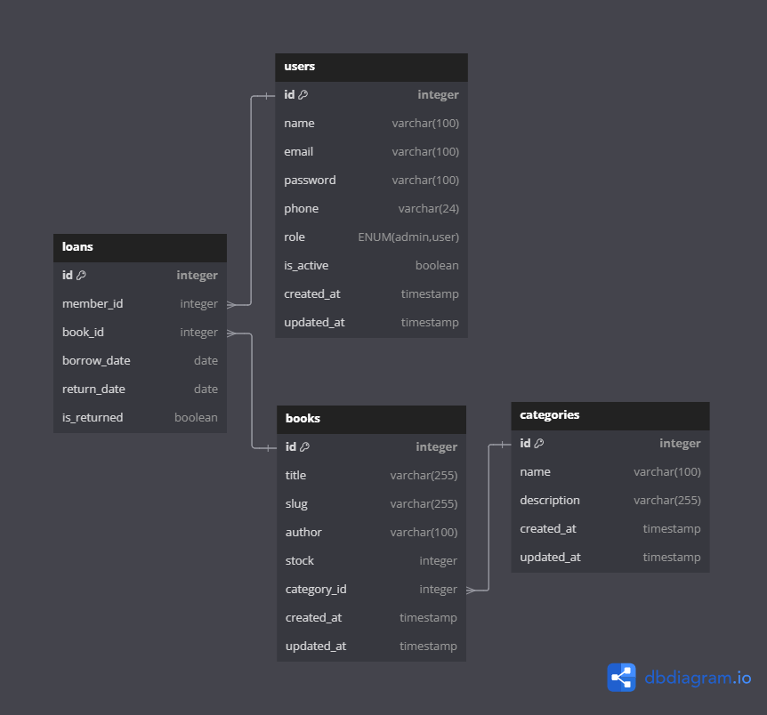

# Library Management Backend Application

This backend application is designed to manage information about books, members, and the book borrowing/returning process. It can be used by school, university, or organizational libraries to streamline and automate library management.

## Key Features

### ERD

### Book Management

*   CRUD (Create, Read, Update, Delete) book data ✅
*   Book information includes: Title, Author, ISBN, Category, Year of Publication, and Stock.✅
*   Search books by title, category, and author.✅

### Member Management

*   CRUD Members ✅
*   Member information includes: Full Name, Member Name, Email, Phone Number, and Membership Status (Active/Inactive) ✅

### Book Borrowing

*   Record book borrowing by members.✅
*   Data validation to check if the book is available before borrowing.✅
*   Setting return deadlines.✅
*   Setting limits on the number of books that can be borrowed.✅

### Book Returning

*   Record book returns by members. ✅
*   Calculation of fines if the return exceeds the deadline.✅

### Reports and Statistics

*   List of frequently borrowed books.❌
*   Report on the number of borrowings per month.❌
*   Statistics on the most active members.❌

### Role-Based Access

*   Admin Role: Manages book data, members, and borrowing.✅
*   Member Role: Views the list of books and their borrowing status.✅

### Security

*   JWT authentication for the API.✅
*   Middleware to ensure that only admins can access certain endpoints.✅

## Technologies Used

*   **Backend**
    *   Framework: Node.js with Express.js
    *   Programming Language: TypeScript
*   **Database**
    *   MariaDB
    *   ORM: Drizzle
*   **Security**
    *   JWT for authentication
    *   Zod for input validation

## How to Run the Application

1.  Clone this repository: `git clone https://github.com/MyKafuuchino/library-management`
2.  Install dependencies: `npm install`
3.  Configure the database: create a `.env` file and fill it with your database connection information.
4.  Run the application: `npm run dev`

## API Documentation

Full documentation for the API endpoints can be found on [Postman](https://www.postman.com/tridata-kawai-team/my-workspace/collection/bgsui8m/library-management?action=share&creator=31958971).

## Contact

Istianto Ilham - istianto.pahlawan@gmail.com